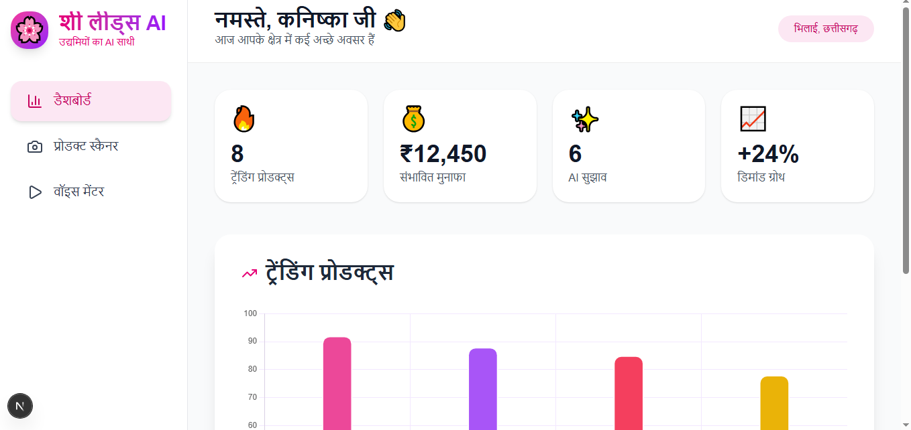
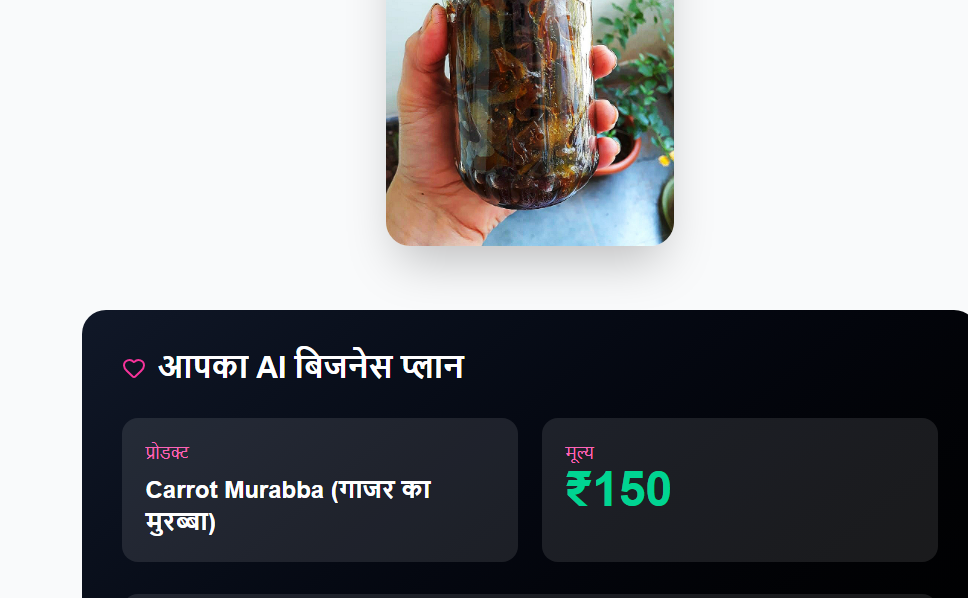
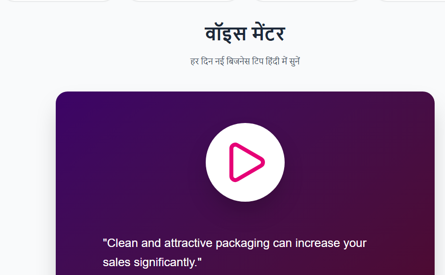

# 🌸 SheaLeads AI

**Empowering Women Micro-Entrepreneurs in India with AI**

A smart web application that helps women in India (especially in small towns and rural areas) start and grow their micro-businesses — tailoring, homemade pickles, papad, spices, handicrafts, and more.

### ✨ What It Does
- **Product Scanner**: Upload a photo of your product → Get AI-powered suggested price, Instagram caption, packaging tips & eco-friendly suggestions
- **Voice Mentor**: Daily practical business tips in **Hindi** (voice playback)
- **Demand Dashboard**: See trending products in your area with beautiful charts
- Made with love for women who want to become self-reliant

---

## 🛠️ Technologies Used

### Frontend
- **Next.js 16** (App Router)
- **TypeScript**
- **Tailwind CSS**
- **React Chart.js 2** (for beautiful charts)
- **Lucide React** (icons)
- **Axios** (API calls)

### Backend
- **Node.js + Express**
- **Multer** (image upload handling)
- **Google Gemini AI** (gemini-2.5-flash-lite) - Image analysis + business intelligence
- **CORS** (for frontend-backend communication)

### Tools & Others
- **VS Code**
- **MongoDB Atlas** (ready for future integration)
- **dotenv** (environment variables)

---

## 🚀 Key Features

- **AI Product Scanner** – Upload photo → Instant business plan
- **Voice Business Mentor** – Daily tips in natural Hindi voice
- **Trending Demand Dashboard** – Visual insights with colorful charts
- **Eco-friendly & Hygiene Suggestions** – Practical tips for small sellers
- **Beautiful, Women-Friendly UI** – Soft pastel + vibrant design

---

## 📸 Screenshots


### 🖥️ Dashboard
<p align="center">
  
</p>

### 📷 Product Scanner
<p align="center">
  
</p>

### 🎙️ Voice Mentor
<p align="center">
  
</p>


## 🛤️ Future Development Roadmap

### Phase 1 (Short Term)
- [ ] User Authentication (Phone OTP)
- [ ] Save scan history in database
- [ ] Multiple regional languages (Chhattisgarhi, Hindi dialects)
- [ ] Better Text-to-Speech (ElevenLabs or Google WaveNet)

### Phase 2 (Medium Term)
- [ ] WhatsApp Bot integration
- [ ] Marketplace connection (sell directly)
- [ ] Cost calculator (raw material vs selling price)
- [ ] Community feature (women entrepreneurs network)

### Phase 3 (Long Term)
- [ ] Offline support (PWA)
- [ ] Local language voice input
- [ ] AI Business Coach with conversation memory
- [ ] Analytics dashboard for growth tracking
- [ ] Integration with UPI payment & logistics

---

## 🧑‍💻 How to Run Locally

### Prerequisites
- Node.js (v18+)
- Gemini API Key (Google AI Studio)

### Backend Setup
```bash
cd shealeads-backend
npm install
cp .env.example .env
# Add your GEMINI_API_KEY
npm run dev